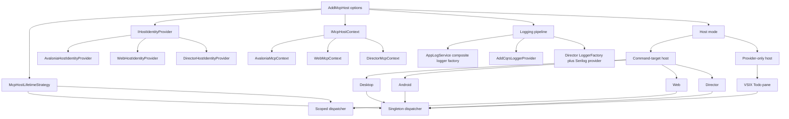

# DI Convergence Diagram

This diagram reflects the post-refactor steady state for `ARCH-REFACTOR-001`.
All five hosts now compose their shared MCP/UI graph through `AddMcpHost(...)`,
while still preserving the two supported host shapes:

- Command-target hosts: Desktop, Android, Web, Director
- Provider-only hosts: VSIX todo tool window

## Notes

- `AddUiCore(...)` remains the leaf shared registration API underneath `AddMcpHost(...)`.
- Desktop and Android build per-connection session providers through their app service factories, then attach the main-window command target after construction.
- Web stays scoped to preserve bearer-token and workspace isolation per request/circuit.
- Director now has one provider entry point: `DirectorHost.CreateProvider(...)`.
- VSIX uses `AddMcpHost(...)` without an `ICommandTarget`, resolving `Dispatcher` directly from the built provider.
