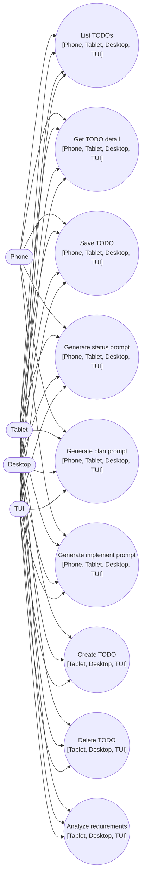
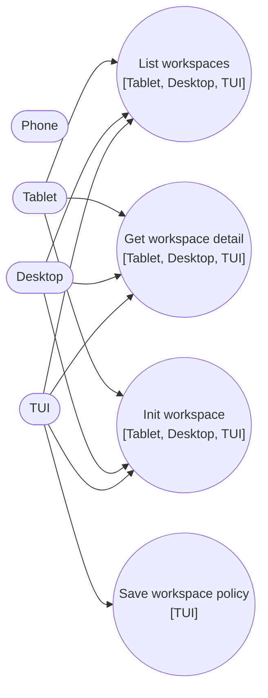
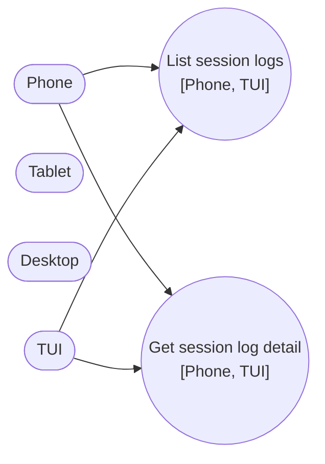
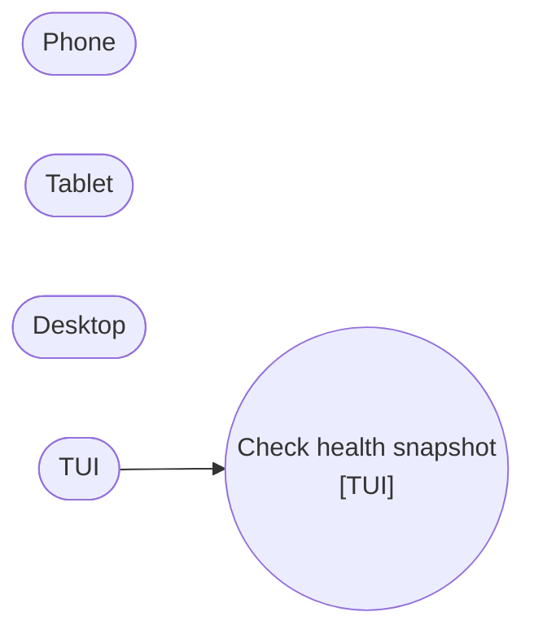
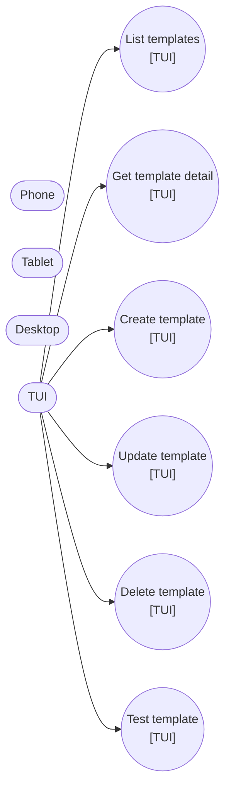
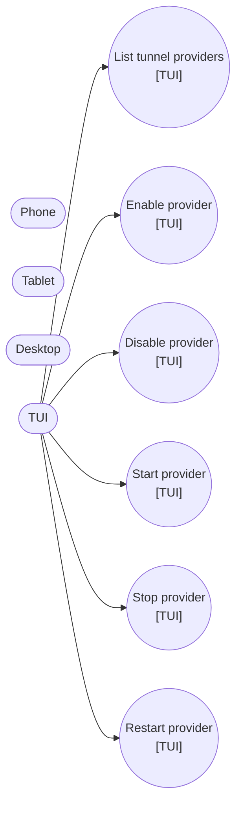

# UI Use Case Coverage Matrix (Phone, Tablet, Desktop, TUI, Blazor)

## Rule

Every user-facing use case should map to a complete chain:

`RelayCommand -> CQRS Message -> Handler -> ViewModel mutation`

This matrix shows current-state UI presence and identifies omissions where the chain is not fully RelayCommand-backed yet.

## Legend

- `UI Tags`: UIs where the use case currently appears (`Phone`, `Tablet`, `Desktop`, `TUI`) plus projected parity target (`Blazor`).
- `Complete`: row has an explicit RelayCommand path to a handler and a concrete ViewModel state mutation.
- `Gap`: use case exists, but there is no exposed RelayCommand chain yet.

## Blazor Surface Inventory Status

- Blazor is a required parity target, but there is no Blazor host implementation in this workspace yet.
- Endpoint/use-case inventory for Blazor is therefore tracked as expected parity with the same UI.Core RelayCommand surfaces listed below.
- Migration status for Blazor wiring remains in plan phase `M5` (`P3.11`, `P4.8`, `M5.2`).

| Endpoint Group | Expected UI.Core RelayCommand Surface for Blazor | Current Blazor Status |
| --- | --- | --- |
| TODO | `TodoListViewModel.RefreshCommand`, `TodoDetailViewModel.*Command` | Not yet wired in RequestTracker |
| Workspace | `WorkspaceListViewModel.RefreshCommand`, `WorkspaceDetailViewModel.GetWorkspaceCommand`, `WorkspacePolicyViewModel.SaveCommand`, `HealthSnapshotsViewModel.InitializeWorkspaceCommand` | Not yet wired in RequestTracker |
| SessionLog | `SessionLogListViewModel.RefreshCommand`, `SessionLogDetailViewModel.LoadCommand` | Not yet wired in RequestTracker |
| Health | `HealthSnapshotsViewModel.CheckHealthCommand` | Not yet wired in RequestTracker |
| Templates | `TemplateListViewModel.RefreshCommand`, `TemplateDetailViewModel.Load/Save/Delete/TestCommand` | Not yet wired in RequestTracker |
| Tunnel | `TunnelListViewModel.Refresh/Enable/Disable/Start/Stop/RestartCommand` | Not yet wired in RequestTracker |

## Complete RelayCommand Use Cases

| Endpoint Group | User Use Case | UI Tags | RelayCommand (ViewModel) | Handler | ViewModel Mutation |
| --- | --- | --- | --- | --- | --- |
| TODO | List TODOs (`GET /mcpserver/todo`) | `[Phone, Tablet, Desktop, TUI]` | `TodoListViewModel.RefreshCommand` | `ListTodosQueryHandler` | `SetItems(...)`, `StatusMessage`, `IsLoading` |
| TODO | Get TODO detail (`GET /mcpserver/todo/{id}`) | `[Phone, Tablet, Desktop, TUI]` | `TodoDetailViewModel.LoadCommand` | `GetTodoQueryHandler` | `Detail`, `ApplyDetailToEditor(...)`, `IsNewDraft`, `StatusMessage` |
| TODO | Create TODO (`POST /mcpserver/todo`) | `[Tablet, Desktop, TUI]` | `TodoDetailViewModel.CreateCommand` | `CreateTodoCommandHandler` | `Detail`, `TodoId`, editor fields, `MutationMessage` |
| TODO | Save TODO (`PUT /mcpserver/todo/{id}`) | `[Phone, Tablet, Desktop, TUI]` | `TodoDetailViewModel.SaveCommand` | `UpdateTodoCommandHandler` | `Detail`, editor fields, `IsDirty`, `MutationMessage` |
| TODO | Delete TODO (`DELETE /mcpserver/todo/{id}`) | `[Tablet, Desktop, TUI]` | `TodoDetailViewModel.DeleteCommand` | `DeleteTodoCommandHandler` | `BeginNewDraft(...)`, `Detail = null`, `MutationMessage` |
| TODO | Analyze requirements (`POST /mcpserver/todo/{id}/requirements`) | `[Tablet, Desktop, TUI]` | `TodoDetailViewModel.AnalyzeRequirementsCommand` | `AnalyzeTodoRequirementsCommandHandler` | `RequirementsAnalysis`, `StatusMessage` |
| TODO | Generate status prompt (`GET /mcpserver/todo/{id}/prompt/status`) | `[Phone, Tablet, Desktop, TUI]` | `TodoDetailViewModel.GenerateStatusPromptCommand` | `GenerateTodoStatusPromptQueryHandler` | `PromptOutput`, `StatusMessage` |
| TODO | Generate plan prompt (`GET /mcpserver/todo/{id}/prompt/plan`) | `[Phone, Tablet, Desktop, TUI]` | `TodoDetailViewModel.GeneratePlanPromptCommand` | `GenerateTodoPlanPromptQueryHandler` | `PromptOutput`, `StatusMessage` |
| TODO | Generate implement prompt (`GET /mcpserver/todo/{id}/prompt/implement`) | `[Phone, Tablet, Desktop, TUI]` | `TodoDetailViewModel.GenerateImplementPromptCommand` | `GenerateTodoImplementPromptQueryHandler` | `PromptOutput`, `StatusMessage` |
| Workspace | List workspaces (`GET /mcpserver/workspace`) | `[Tablet, Desktop, TUI]` | `WorkspaceListViewModel.RefreshCommand` | `ListWorkspacesQueryHandler` | `Workspaces` collection, `TotalCount`, `ErrorMessage` |
| Workspace | Get workspace detail (`GET /mcpserver/workspace/{key}`) | `[Tablet, Desktop, TUI]` | `WorkspaceDetailViewModel.GetWorkspaceCommand` | `GetWorkspaceQueryHandler` | `Detail`, `StatusMessage`, `ErrorMessage` |
| Workspace | Save workspace policy (`PUT /mcpserver/workspace/{key}` via policy fields) | `[TUI]` | `WorkspacePolicyViewModel.SaveCommand` | `UpdateWorkspacePolicyCommandHandler` | `SaveSucceeded`, `ErrorMessage`, `IsSaving` |
| SessionLog | List session logs (`GET /mcpserver/sessionlog`) | `[Phone, TUI]` | `SessionLogListViewModel.RefreshCommand` | `ListSessionLogsQueryHandler` | `SetItems(...)`, `StatusMessage`, `IsLoading` |
| SessionLog | Get session log detail (`GET /mcpserver/sessionlog` item by id) | `[Phone, TUI]` | `SessionLogDetailViewModel.LoadCommand` | `GetSessionLogQueryHandler` | `Detail`, `StatusMessage`, `ErrorMessage` |
| Health | Check health snapshot (`GET /health`) | `[TUI]` | `HealthSnapshotsViewModel.CheckHealthCommand` | `CheckHealthQueryHandler` | `Items.Insert(0, ...)`, `SelectedIndex`, `TotalCount`, `StatusMessage` |
| Workspace | Init workspace (`POST /mcpserver/workspace/{key}/init`) | `[Tablet, Desktop, TUI]` | `HealthSnapshotsViewModel.InitializeWorkspaceCommand` | `InitWorkspaceCommandHandler` | `StatusMessage`, `ErrorMessage`, `LastRefreshedAt`, `IsLoading` |
| Tunnel | List providers (`GET /mcpserver/tunnel/list`) | `[TUI]` | `TunnelListViewModel.RefreshCommand` | `ListTunnelsQueryHandler` | `SetItems(...)`, `ErrorMessage`, `IsLoading` |
| Tunnel | Enable provider (`POST /mcpserver/tunnel/{provider}/enable`) | `[TUI]` | `TunnelListViewModel.EnableCommand` | `EnableTunnelCommandHandler` | `Items` refresh via `LoadAsync()`, `ErrorMessage`, `StatusMessage` |
| Tunnel | Disable provider (`POST /mcpserver/tunnel/{provider}/disable`) | `[TUI]` | `TunnelListViewModel.DisableCommand` | `DisableTunnelCommandHandler` | `Items` refresh via `LoadAsync()`, `ErrorMessage`, `StatusMessage` |
| Tunnel | Start provider (`POST /mcpserver/tunnel/{provider}/start`) | `[TUI]` | `TunnelListViewModel.StartCommand` | `StartTunnelCommandHandler` | `Items` refresh via `LoadAsync()`, `ErrorMessage`, `StatusMessage` |
| Tunnel | Stop provider (`POST /mcpserver/tunnel/{provider}/stop`) | `[TUI]` | `TunnelListViewModel.StopCommand` | `StopTunnelCommandHandler` | `Items` refresh via `LoadAsync()`, `ErrorMessage`, `StatusMessage` |
| Tunnel | Restart provider (`POST /mcpserver/tunnel/{provider}/restart`) | `[TUI]` | `TunnelListViewModel.RestartCommand` | `RestartTunnelCommandHandler` | `Items` refresh via `LoadAsync()`, `ErrorMessage`, `StatusMessage` |
| Templates | List templates (`GET /mcpserver/templates`) | `[TUI]` | `TemplateListViewModel.RefreshCommand` | `ListTemplatesQueryHandler` | `SetItems(...)`, `StatusMessage`, `IsLoading` |
| Templates | Get template detail (`GET /mcpserver/templates/{id}`) | `[TUI]` | `TemplateDetailViewModel.LoadCommand` | `GetTemplateQueryHandler` | `Detail`, `Editor*` fields via `PopulateEditorFromDetail()`, `StatusMessage`, `ErrorMessage` |
| Templates | Create template (`POST /mcpserver/templates`) | `[TUI]` | `TemplateDetailViewModel.SaveCommand` (draft mode) | `CreateTemplateCommandHandler` | `Detail`, `IsNewDraft`, `StatusMessage`, `ErrorMessage` |
| Templates | Update template (`PUT /mcpserver/templates/{id}`) | `[TUI]` | `TemplateDetailViewModel.SaveCommand` (edit mode) | `UpdateTemplateCommandHandler` | `Detail`, `StatusMessage`, `ErrorMessage` |
| Templates | Delete template (`DELETE /mcpserver/templates/{id}`) | `[TUI]` | `TemplateDetailViewModel.DeleteCommand` | `DeleteTemplateCommandHandler` | `Detail = null`, `StatusMessage`, `ErrorMessage` |
| Templates | Test template (`POST /mcpserver/templates/{id}/test`) | `[TUI]` | `TemplateDetailViewModel.TestCommand` | `TestTemplateQueryHandler` | `TestOutput`, `StatusMessage`, `ErrorMessage` |

## Omissions (Use Case Exists, RelayCommand Chain Missing)

No open omissions in this matrix after GAP-020 closure. Workspace init, tunnel lifecycle, and template detail operations are now RelayCommand-backed in UI.Core.

---

## Divergent UI Behavior Annotations

### Complete-path use cases

- `List TODOs` (`GET /mcpserver/todo`)
  - `Phone`: Dedicated list screen with tap-to-detail navigation and explicit refresh button.
  - `Tablet`: Split-pane grouped list with filter controls and context-menu actions.
  - `Desktop`: Same split-pane model as tablet, plus extra Copilot context-menu actions and desktop chat affordances.
  - `TUI`: Table-first workflow with section filter, show/hide completed toggle, and sortable columns.

- `Get TODO detail` (`GET /mcpserver/todo/{id}`)
  - `Phone`: Two-screen flow (formatted detail + separate markdown edit screen).
  - `Tablet`: Detail loaded into right-side editor pane without leaving list context.
  - `Desktop`: Same in-pane detail model as tablet, with richer editor toolbar controls.
  - `TUI`: Read/write detail pane auto-updates from selected row and supports explicit reload.

- `Create TODO` (`POST /mcpserver/todo`)
  - `Tablet`: Inline “new item” form in list workflow.
  - `Desktop`: Same inline-create pattern as tablet, integrated into split view.
  - `TUI`: `New` action seeds a draft in full-field form before save.
  - `Phone`: No first-class create affordance in current phone-specific TODO flow.

- `Save TODO` (`PUT /mcpserver/todo/{id}`)
  - `Phone`: Save runs from dedicated markdown edit screen and then navigates back to formatted detail on success.
  - `Tablet`: Save is in-panel via editor toolbar command.
  - `Desktop`: Same as tablet, with additional editor tooling in the same save surface.
  - `TUI`: Save commits full field set, then refreshes/rebinds list + detail panes.

- `Delete TODO` (`DELETE /mcpserver/todo/{id}`)
  - `Tablet`: Delete exposed through list-item context menu.
  - `Desktop`: Same context-menu delete pattern as tablet.
  - `TUI`: Dedicated delete button with confirmation dialog.
  - `Phone`: No direct delete affordance in current phone TODO UI.

- `Analyze requirements` (`POST /mcpserver/todo/{id}/requirements`)
  - `Tablet`: Context-menu action on selected TODO.
  - `Desktop`: Same context-menu pattern as tablet.
  - `TUI`: Explicit `Reqs` action with analysis result rendered in detail pane.
  - `Phone`: No direct analyze action in current phone TODO UI.

- `Generate status prompt` (`GET /mcpserver/todo/{id}/prompt/status`)
  - `Phone`: Dedicated `Status` action from formatted detail screen.
  - `Tablet`: No direct status-prompt control currently surfaced.
  - `Desktop`: Context-menu prompt action from selected TODO.
  - `TUI`: Prompt action opens streaming dialog and then updates detail pane.

- `Generate plan prompt` (`GET /mcpserver/todo/{id}/prompt/plan`)
  - `Phone`: Dedicated `Plan` action from formatted detail screen.
  - `Tablet`: No direct plan-prompt control currently surfaced.
  - `Desktop`: Context-menu prompt action from selected TODO.
  - `TUI`: Prompt action uses stream dialog + detail-pane update flow.

- `Generate implement prompt` (`GET /mcpserver/todo/{id}/prompt/implement`)
  - `Phone`: Dedicated `Implement` action from formatted detail screen.
  - `Tablet`: No direct implement-prompt control currently surfaced.
  - `Desktop`: Context-menu prompt action from selected TODO.
  - `TUI`: Prompt action streams output and projects result to detail pane.

- `List workspaces` (`GET /mcpserver/workspace`)
  - `Tablet`: Workspace tab mixes list + editing/process controls in one surface.
  - `Desktop`: Same broad list/edit/process surface, with larger multi-panel composition.
  - `TUI`: Focused list table and detail pane workflow.
  - `Phone`: No workspace tab in current phone shell.

- `Get workspace detail` (`GET /mcpserver/workspace/{key}`)
  - `Tablet`: Selected workspace populates editable form fields.
  - `Desktop`: Editable form + additional global/workspace prompt template sections in same view.
  - `TUI`: Read-only formatted detail text in lower pane.
  - `Phone`: Use case not surfaced in phone shell.

- `Save workspace policy` (`PUT /mcpserver/workspace/{key}` via policy fields)
  - `TUI`: Dedicated policy screen with four ban-list text areas and explicit save command.
  - `Desktop/Tablet`: Policy-like fields exist within broader workspace editing, not as a standalone policy command screen.
  - `Phone`: Use case not surfaced.

- `List session logs` (`GET /mcpserver/sessionlog`)
  - `Phone`: Hierarchical mobile list (groups + leaves + “All JSON” entry) with screen navigation.
  - `TUI`: Flat table listing with status row and quick refresh.
  - `Tablet/Desktop`: No equivalent session-log tab in current tablet/desktop shells.

- `Get session log detail` (`GET /mcpserver/sessionlog` item by id)
  - `Phone`: Multi-mode detail viewer (JSON summary, markdown/source, request details).
  - `TUI`: Single flattened text-rendered detail view.
  - `Tablet/Desktop`: Not surfaced as a dedicated session-log detail use case.

- `Check health snapshot` (`GET /health`)
  - `TUI`: Dedicated health tab with explicit check action and raw payload view.
  - `Phone/Tablet/Desktop`: Show health indicators in shell status, but no direct health-snapshot command surface.

- `List templates` (`GET /mcpserver/templates`)
  - `TUI`: Filter + table workflow with template management context.
  - `Phone/Tablet/Desktop`: Use case not surfaced in current shells.

### GAP-020 use cases (closed, now RelayCommand-backed)

- `Init workspace` (`POST /mcpserver/workspace/{key}/init`) — `CLOSED`
  - `Tablet/Desktop`: Toolbar `Init` command in workspace view.
  - `TUI`: `Init Workspace` action in health screen.
  - Divergence: entry point location still differs by host, but all hosts can now target shared `HealthSnapshotsViewModel.InitializeWorkspaceCommand`.

- `List tunnel providers` (`GET /mcpserver/tunnel/list`) — `CLOSED`
  - `TUI`: Dedicated tunnel table (provider/enabled/status/public URL/error).
  - `Phone/Tablet/Desktop`: No tunnel UI surface yet.

- `Enable/Disable/Start/Stop/Restart tunnel provider` (`POST /mcpserver/tunnel/...`) — `CLOSED`
  - `TUI`: Lifecycle buttons with state-dependent labels/enabling.
  - `Phone/Tablet/Desktop`: No tunnel lifecycle controls yet.

- `Get/Create/Update/Delete/Test template` (`/mcpserver/templates/*`) — `CLOSED`
  - `TUI`: Selection-driven detail flow plus modal create/edit/test and delete actions.
  - `Phone/Tablet/Desktop`: No template management surface yet.

---

## Mermaid Use Case Diagrams

### TODO Endpoints

### Workspace Endpoints

### SessionLog Endpoints

### Health Endpoints

### Template Endpoints

### Tunnel Endpoints

## Source Inventory Used

- `lib/McpServer/src/McpServer.UI.Core/ViewModels/*`
- `lib/McpServer/src/McpServer.UI.Core/Handlers/*`
- `src/McpServerManager.Desktop/Views/*`
- `src/McpServerManager.Android/Views/*`
- `lib/McpServer/src/McpServer.Director/Screens/*`
- `Blazor host: not present in this workspace; inventory tracked as projected parity surface`
